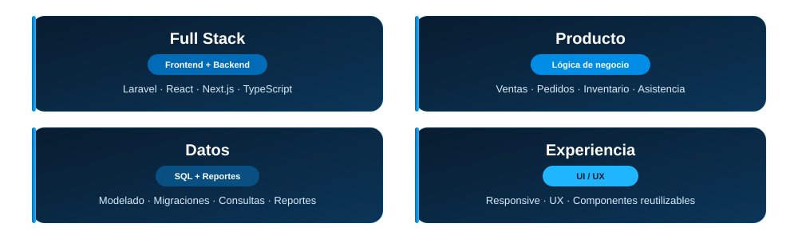
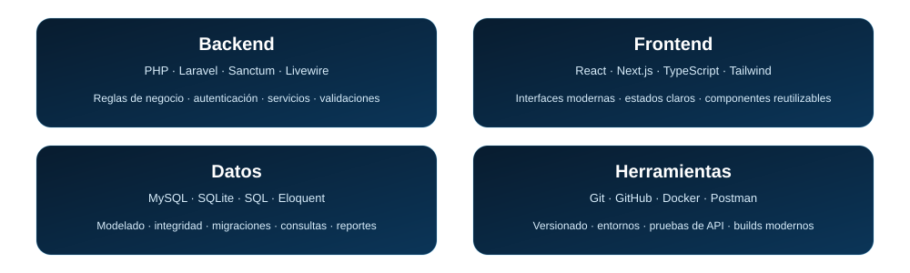
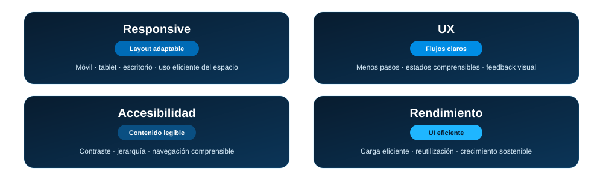
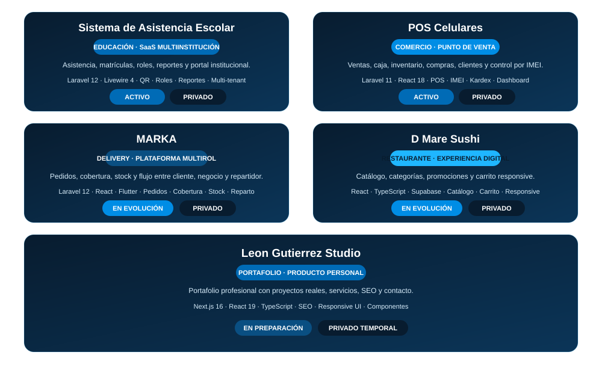
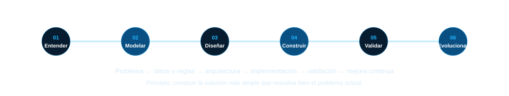
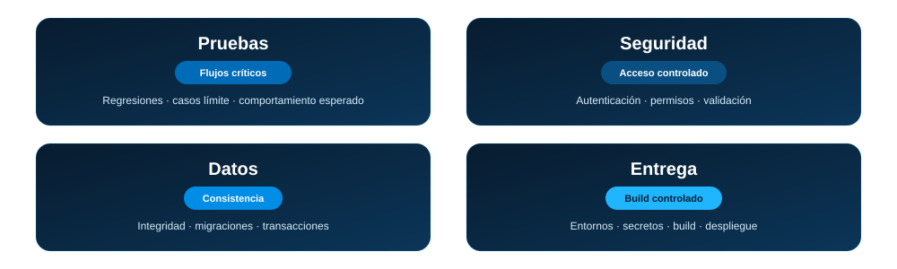
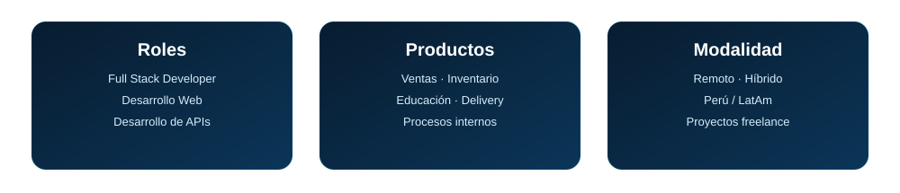

  
  
  

  
  
  
  

Soy <b>Ingeniero de Sistemas e Informática</b> enfocado en desarrollo <b>Full Stack</b>. 
Construyo soluciones web desde la lógica de negocio y los datos hasta una experiencia clara, responsive y mantenible.

  

 

<b>Objetivo:</b> transformar procesos reales en software útil, mantenible y preparado para evolucionar.

  

 

<b>Objetivo:</b> interfaces atractivas, rápidas y fáciles de usar.

  
  
  
  

  
  
  

 

<b>Busco aportar en productos donde el software tenga impacto directo en la operación y pueda evolucionar con el negocio.</b>

  

<b>WhatsApp:</b> +51 903 434 968 
<b>Correo:</b> saulalexleongutierrez@gmail.com

  

Perú · disponible para oportunidades remotas, híbridas y proyectos freelance.

 

### <code>Código claro · Interfaces útiles · Software preparado para evolucionar</code>

