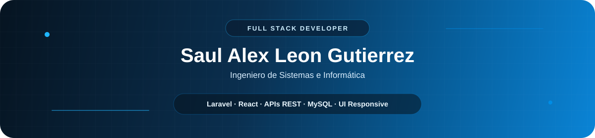

  
  
  

  
  
  
  

Soy <b>Ingeniero de Sistemas e Informática</b> enfocado en desarrollo <b>Full Stack</b>. 
Construyo soluciones web desde la lógica de negocio y los datos hasta una experiencia clara, responsive y mantenible.

 

<table width="100%" align="center">
<tr>
<td width="50%" align="center" valign="middle">

<h3>🧩 Full Stack</h3>
  
Laravel · React · Next.js · TypeScript

</td>
<td width="50%" align="center" valign="middle">

<h3>🧠 Producto</h3>
  
Ventas · Pedidos · Inventario · Asistencia

</td>
</tr>
</table>

 

<table width="100%" align="center">
<tr>
<td width="50%" align="center" valign="middle">

<h3>🗄️ Datos</h3>
  
Modelado · Migraciones · Consultas · Reportes

</td>
<td width="50%" align="center" valign="middle">

<h3>🎨 Experiencia</h3>
  
Responsive · UX · Componentes reutilizables

</td>
</tr>
</table>

<b>Objetivo:</b> transformar procesos reales en software útil, mantenible y preparado para evolucionar.

 

<table width="100%" align="center">
<tr>
<td width="50%" align="center" valign="top">

<h3>Backend</h3>

  
Reglas de negocio · autenticación · servicios · validaciones

</td>
<td width="50%" align="center" valign="top">

<h3>Frontend</h3>

  
Interfaces modernas · estados claros · componentes reutilizables

</td>
</tr>
</table>

 

<table width="100%" align="center">
<tr>
<td width="50%" align="center" valign="top">

<h3>Datos</h3>

  
Modelado · integridad · migraciones · consultas · reportes

</td>
<td width="50%" align="center" valign="top">

<h3>Herramientas</h3>

  
Versionado · entornos · pruebas de API · builds modernos

</td>
</tr>
</table>

<table width="100%" align="center">
<tr>
<td width="50%" align="center" valign="middle">

<h3>📱 Responsive</h3>
  
Móvil · tablet · escritorio · uso eficiente del espacio

</td>
<td width="50%" align="center" valign="middle">

<h3>🧩 UX</h3>
  
Menos pasos · estados comprensibles · feedback visual

</td>
</tr>
</table>

 

<table width="100%" align="center">
<tr>
<td width="50%" align="center" valign="middle">

<h3>♿ Accesibilidad</h3>
  
Contraste · jerarquía · navegación comprensible

</td>
<td width="50%" align="center" valign="middle">

<h3>⚡ Rendimiento</h3>
  
Carga eficiente · reutilización · crecimiento sostenible

</td>
</tr>
</table>

<b>Objetivo:</b> interfaces atractivas, rápidas y fáciles de usar.

<table width="100%" align="center">
<tr>
<td width="50%" align="center" valign="top">

<h3>🏫 Sistema de Asistencia Escolar</h3>

  
Asistencia, matrículas, roles, reportes y portal institucional.
  

  
<code>QR</code> · <code>Roles</code> · <code>Reportes</code> · <code>Multi-tenant</code>
  

</td>
<td width="50%" align="center" valign="top">

<h3>📱 POS Celulares</h3>

  
Ventas, caja, inventario, compras, clientes y control por IMEI.
  

  
<code>POS</code> · <code>IMEI</code> · <code>Kardex</code> · <code>Dashboard</code>
  

</td>
</tr>
</table>

 

<table width="100%" align="center">
<tr>
<td width="50%" align="center" valign="top">

<h3>🚚 MARKA</h3>

  
Pedidos, cobertura, stock y flujo entre cliente, negocio y repartidor.
  

  
<code>Pedidos</code> · <code>Cobertura</code> · <code>Stock</code> · <code>Reparto</code>
  

</td>
<td width="50%" align="center" valign="top">

<h3>🍣 D Mare Sushi</h3>

  
Catálogo, categorías, promociones y carrito responsive.
  

  
<code>Catálogo</code> · <code>Carrito</code> · <code>Responsive</code> · <code>Supabase</code>
  

</td>
</tr>
</table>

<table width="100%" align="center">
<tr>
<td width="100%" align="center" valign="middle">

<h3>🌐 Leon Gutierrez Studio</h3>

  
Portafolio profesional con proyectos reales, servicios, SEO y contacto.
  

  

</td>
</tr>
</table>

  

<b>Problema → datos y reglas → arquitectura → implementación → validación → mejora continua</b>

  

<b>Principio:</b> construir la solución más simple que resuelva bien el problema actual.

<table width="100%" align="center">
<tr>
<td width="50%" align="center" valign="middle">

<h3>🧪 Pruebas</h3>
  
Regresiones · casos límite · comportamiento esperado

</td>
<td width="50%" align="center" valign="middle">

<h3>🔐 Seguridad</h3>
  
Autenticación · permisos · validación

</td>
</tr>
</table>

 

<table width="100%" align="center">
<tr>
<td width="50%" align="center" valign="middle">

<h3>🗄️ Datos</h3>
  
Integridad · migraciones · transacciones

</td>
<td width="50%" align="center" valign="middle">

<h3>🚀 Entrega</h3>
  
Entornos · secretos · build · despliegue

</td>
</tr>
</table>

  
  
  
  

  
  
  

<table width="100%" align="center">
<tr>
<td width="33.33%" align="center" valign="middle">

<h3>🎯 Roles</h3>
Full Stack Developer 
Desarrollo Web 
Desarrollo de APIs

</td>
<td width="33.33%" align="center" valign="middle">

<h3>🏢 Productos</h3>
Ventas · Inventario 
Educación · Delivery 
Procesos internos

</td>
<td width="33.33%" align="center" valign="middle">

<h3>🌎 Modalidad</h3>
Remoto · Híbrido 
Perú / LatAm 
Proyectos freelance

</td>
</tr>
</table>

<b>Busco aportar en productos donde el software tenga impacto directo en la operación y pueda evolucionar con el negocio.</b>

  

<b>WhatsApp:</b> +51 903 434 968 
<b>Correo:</b> saulalexleongutierrez@gmail.com

  

Perú · disponible para oportunidades remotas, híbridas y proyectos freelance.

 

### <code>Código claro · Interfaces útiles · Software preparado para evolucionar</code>

